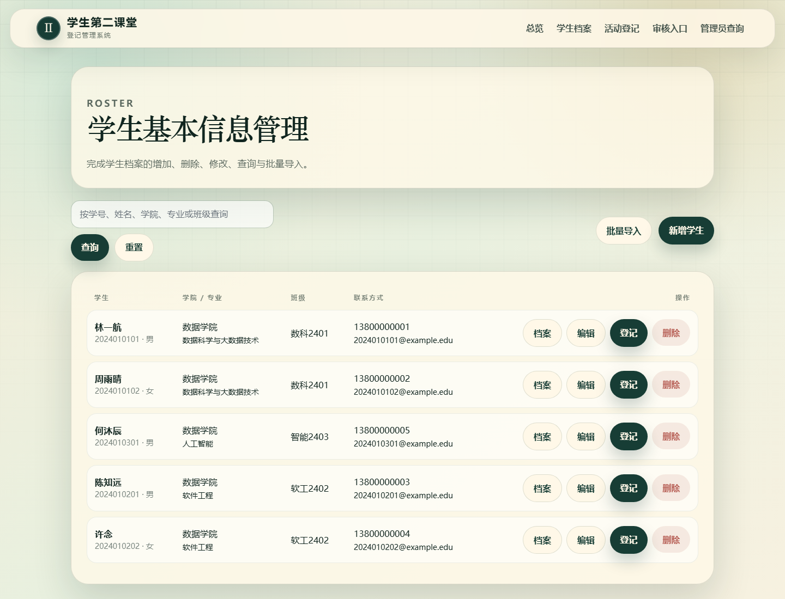
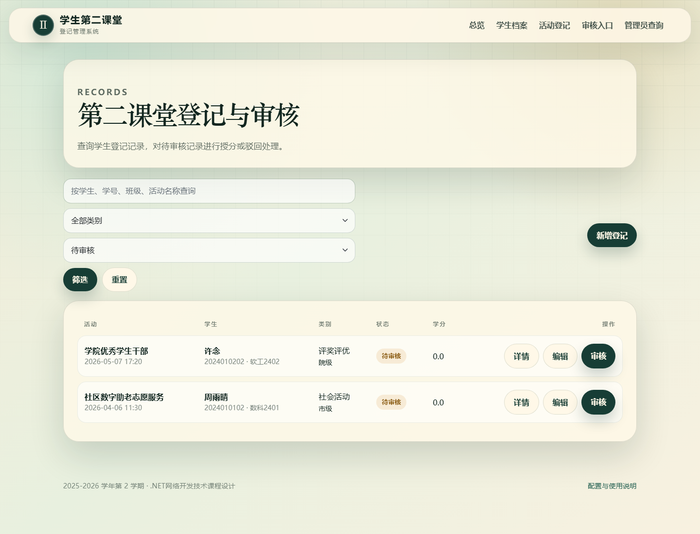
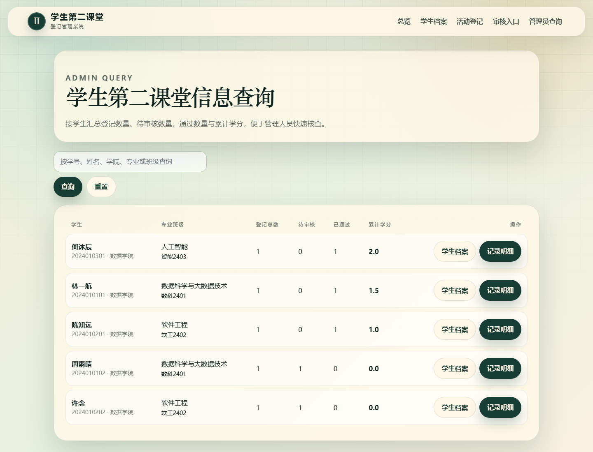

# 学生第二课堂登记管理系统

一个基于 **ASP.NET Core MVC + SQLite** 的《.NET网络开发技术》课程设计项目，用于管理学生第二课堂档案、活动登记、审核授分和管理员查询统计。

## 项目简介

系统围绕高校第二课堂学分认定流程设计，覆盖学生登录登记、个人中心查看、管理员档案维护、活动审核授分、统计查询和数据导出的完整业务闭环。项目首次运行会自动创建 SQLite 数据库，并生成超过 100 条演示数据，便于课程答辩、功能展示和代码评审。

## 功能模块

- **分角色登录**：提供学生登录入口和管理员登录入口，登录后分别进入学生个人中心和管理员工作台。
- **现代化 UI**：登录入口、顶部导航、卡片、表格、表单和统计面板采用统一的蓝绿渐变教务工作台风格。
- **系统总览**：管理员端展示学生数量、登记记录、待审核记录、已通过记录、累计学分、待审核占比、学分达标概况和学院学分排行。
- **学生档案管理**：支持学生基本信息的新增、编辑、删除、查询和批量导入。
- **学生名单导入**：支持 CSV / TXT 文件导入，重复学号自动更新。
- **第二课堂登记**：学生可登记社会活动、科研与竞赛、评奖评优、认证考试、奖励表彰、志愿服务、创新创业等记录，并填写活动时长和申请学分。
- **审核授分**：管理员可审核记录，填写审核意见并认定最终第二课堂学分，系统自动保留每次审核历史。
- **权限控制**：学生只能查看自己的记录，只能编辑自己名下的待审核申请；已通过或未通过记录不能由学生继续修改学分。
- **学分达标预警**：按 4.0 目标学分展示已达标、接近达标、未达标状态和距离目标学分。
- **数据导出**：支持导出学生第二课堂汇总 CSV，以及按当前筛选条件导出活动记录 CSV。
- **管理员查询**：按学生汇总登记总数、待审核数量、通过数量、累计学分和达标状态，并可查看明细。
- **数据库自动初始化**：首次运行自动创建数据表、索引、视图、触发器、审核日志表和样例数据。

## 技术栈

| 类型 | 技术 |
| --- | --- |
| 后端框架 | ASP.NET Core MVC |
| 目标框架 | .NET 6.0 |
| 编程语言 | C#、Razor、HTML、CSS |
| 数据库 | SQLite |
| 数据访问 | ADO.NET / Microsoft.Data.Sqlite |
| 前端样式 | Bootstrap + 自定义现代化 CSS |

## 项目结构

```text
SecondClassroomManager
├── Controllers                 # MVC 控制器
├── Data                        # 数据库初始化与仓储层
├── Database                    # SQLite 建表脚本
├── Models                      # 数据模型与视图模型
├── Views                       # Razor 视图页面
├── wwwroot                     # 静态资源
├── App_Data                    # SQLite 数据库文件
├── Docs                        # 课程报告、说明文档、截图
├── README.md                   # 项目说明
└── SecondClassroomManager.csproj
```

## 运行环境

- Windows 10/11、Linux 或 macOS
- .NET SDK 6.0 或更高版本
- Edge、Chrome 或 Firefox 浏览器

## 快速开始

进入项目目录：

```bash
cd "D:\Document\Course\C#\大作业\SecondClassroomManager"
```

如果在 WSL 中运行当前 D 盘项目，可以使用：

```bash
cd "/mnt/d/Document/Course/C#/大作业/SecondClassroomManager"
"/mnt/c/Program Files/dotnet/dotnet.exe" run --urls "http://127.0.0.1:5080"
```

然后打开：

```text
http://127.0.0.1:5080
```

还原依赖：

```bash
dotnet restore
```

编译项目：

```bash
dotnet build
```

启动系统：

```bash
dotnet run
```

浏览器打开终端输出的地址，例如：

```text
http://localhost:5000
https://localhost:5001
```

## 登录账号

- **管理员端**：账号 `admin`，密码 `123456`。
- **学生端**：使用学生档案中的学号和手机号登录，演示账号 `2024010101`，密码 `13800000001`。
- 学生登录页会默认填入演示账号，便于直接进入学生个人中心展示功能。

## 实用增强功能

- **达标状态**：管理员汇总页和学生个人中心会显示累计学分、达标状态和距离目标学分。
- **申请学分**：学生提交待审核活动时可填写申请学分，管理员审核时再认定最终学分。
- **活动时长校验**：新建和编辑申请时要求活动时长大于 0，演示数据启动时也会自动修复 0 小时记录。
- **审核历史**：活动详情页展示每次审核的状态变化、学分变化、审核意见和审核时间。
- **CSV 导出**：管理员汇总页可导出学生汇总，活动记录页可按关键词、状态和类别导出当前结果，并对 Excel 公式风险字段进行转义。
- **首页统计**：首页增加达标人数、接近达标人数、未达标人数、待审核占比和学院累计学分排行。

## 默认数据

系统首次运行会自动创建数据库：

```text
App_Data/second_classroom.db
```

数据库会自动包含：

- 100+ 名学生样例数据
- 100+ 条第二课堂活动登记样例数据
- 已通过、待审核、未通过等多种审核状态
- 待审核记录带有申请学分，不会以 0 学分进入审核
- 活动记录带有大于 0 的活动时长
- 社会活动、科研竞赛、评奖评优、认证考试、奖励表彰等多种类别

如果想重新生成初始数据，可以关闭程序后删除：

```text
App_Data/second_classroom.db
```

然后重新执行：

```bash
dotnet run
```

## 学生导入格式

支持 `.csv` 或 `.txt` 文件，字段顺序如下：

```text
学号,姓名,性别,学院,专业,班级,电话,邮箱
2024010106,王星河,男,数据学院,软件工程,软工2402,13800000006,2024010106@example.edu
```

## 功能截图

### 系统总览


### 学生基本信息管理



### 第二课堂登记与审核



### 管理员查询



## 课程设计提交内容

项目已包含课程设计要求中的主要交付物：

- 完整 ASP.NET Core MVC 源码
- SQLite 数据库文件
- 数据库建表脚本
- 软件配置与使用说明
- 功能模块截图
- 课程设计报告文档

相关文档位于：

```text
Docs/
```

## 说明

本项目用于课程设计学习与展示。提交前请根据个人情况补充课程设计报告封面中的专业班级、学号、姓名等信息。
